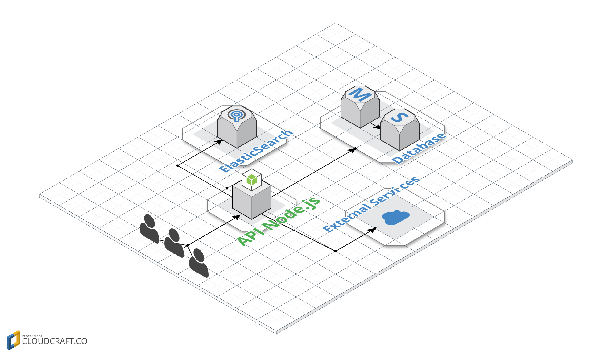

# Utilizando Cache com Redis e Node.js


[](https://travis-ci.org/Kirmayrtomaz/cache_redis_node)
[](https://codecov.io/github/Kirmayrtomaz/cache_redis_node) [](https://david-dm.org/Kirmayrtomaz/cache_redis_node)
[](https://david-dm.org/Kirmayrtomaz/cache_redis_node/dev-status)
[](LICENSE)


# Sumário

* Cache
  * [Introdução](#introducao)
  * Tipos de Cache
    * Cache no cliente(Browser)
    * Cache no Servidor web
    * Cache na Aplicação
  * Vantagens e desvagens de cachear em cada cenário
  * Utilizando cache como um serviço
  * Redis
  * Comparando Redis com memcached
  * Instalando e utilizando Redis e Node.js para cache
    * Cliando um middleware para ser utilizado no express
    * Criando um PUB/SUB para eliminar cache antigos


# Introdução

Atualmente, existem várias APIs em Node.js que trabalham com muito processamento, consulta em banco de dados relacionais e não relacionais, acesso em disco,  serviços legado e inclusive outras APIs. Diversos fatores que geram tempo de requisição, banda, e processamento, nos deixam sujeitos a estruturas que, se mal planejadas, podem gerar um débito técnico no futuro, requerendo mudanças na arquitetura para melhorar a performance da Aplicação. Outras vezes ficamos presos a serviços impostos pelo cliente e seus requisitos, o que nos impede de implementar algo mais estruturado.

Quando você para pra perceber todos os detalhes da sua aplicação, entende que podem existir processos que são realizados várias vezes e retornam dados que não são alterados com tanta frequência. A cada solicitação feita, como a leitura de arquivo, serviços de terceiros ou banco, caímos em uma série de fatores que implicam em tempo, processamento e banda.

Uma situação, por exemplo, seria eu ter que acessar um arquivo e retorná-lo para o usuário. Nesse caso, como já apresentado na literatura, a leitura de um arquivo é lenta, e depende de diversas condições, entre tempo de Seek, o quão espalhado esse arquivo está no seu HD, e outras.

Agora, imagine outra situação. Sua API precisa fazer uma requisição para 5 outros serviços que vão desde a uma request SOAP, consulta ao banco, serviços de terceiros e uma busca no Elasticsearch. Supondo que cada requisição demore 1000ms, precisaríamos de um tempo total de 5000ms para retornar a requisição. No caso do Node.js, poderíamos utilizar algum pacote npm para que as requisições fossem chamadas em paralelo.  Mesmo assim, se eu fizer a mesma requisição várias vezes na minha API e os dados dos outros serviços não forem alteradas com constância, nossa aplicação realizará o mesmo procedimento várias vezes.





# Instalando dependencias

Esse projeto, mostra um exemplo em que consultaremos as organizações do github e salvaremos no banco de dados, e retornar a consulta caso já esteha cacheado.

Possuiremos duas rotas
  * **/orgs/{nomeDaOrganizacao}** -> que irá retornar dados da organização
  * **/orgs** -> que irá retornar todas as organizações que já foram consultadas


## Biblioteca do redis para instalar

```   javascript
npm i --save redis
```
or

```
yarn add redis
```

## Inicializando no projeto

```  javascript
const redis = require('redis');
const cache = redis.createClient();

```
## Verificando se a conexão ocorreu com sucesso

```   javascript
cache.on('connect', () => {
  console.log('REDIS READY');
});

cache.on('error', (e) => {
  console.log('REDIS ERROR', e);
});

```


## função para setar o cache

```  javascript
const timeInSecond = 'EX';
const time = 10;
cache.set(keyName, value, timeInSecond, time)
```
* KeyName => será a chave onde será salvo o valor
* value => será o valor que será salvo, no geral pode ser string, inteiro ou objeto de primeira ordem
* timeInSecond => tipo de temporizador que irá utilizar
  * 'EX' => Tempo em segundos
  * 'PX' => Tempo em milisegundos
  * 'NX' => Inserir se não existir
  * 'EX' => Inserir se existir


[123123123](#dependencia)
## função para setar dados de cache

```  javascript
cache.get(keyName);
```

<a href='#dependecias'>teste</a>

## Criando um middleware para o express

```   javascript
const http = require('http');
const express = require('express');
const Promise = require('bluebird');

function cacheMiddleware(req, res, next) {
  return Promise.coroutine(function* () {
    const keyName = req.originalUrl;

    const cacheRes = yield getCache(keyName);

    if (cacheRes) {
      return res.json(cacheRes);
    }
    next();
  })();
}


const app = express(APP_PORT);
httpServer = http.Server(app);
app.use(cacheMiddleware);

app.get('/', (req, res) => {
  res.json({ status: 'The NODE_REDIS XD' });
});

```


## Criando um canal de PUB/SUB


```   javascript
const sub = redis.createClient(REDIS_PORT, REDIS_HOST);
const sub = redis.createClient(REDIS_PORT, REDIS_HOST);

sub.on('message', () => {

});

sub.subscribe('clean_cache');

pub.publish(canal, 'clean');

```


com `express.js` `mongo` `redis` que irá salv

Estas vão rodar em dos cenários, é criando um middleware simples para verificar se já existe cache e retornar os dados

E na outra etapa iremos setar o cache caso necessário, e limpar uma key através de um canal de **PUB/SUB**


Para subir as dependências externas do projeto
* Redis
* MongoDb

basta utilizar esse comando abaixo

```
docker-compose up
```
