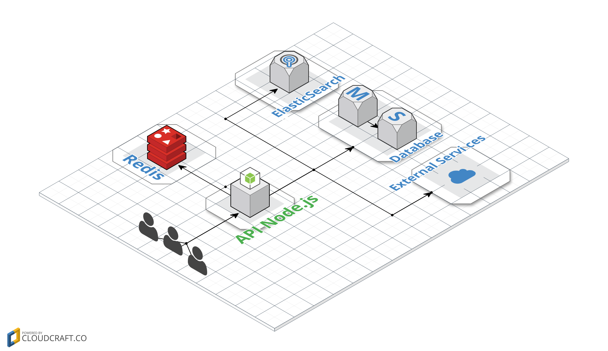
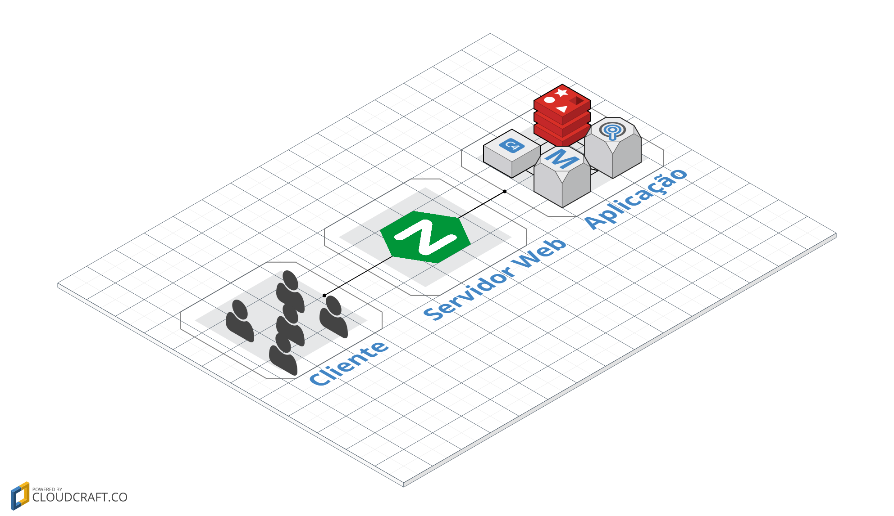
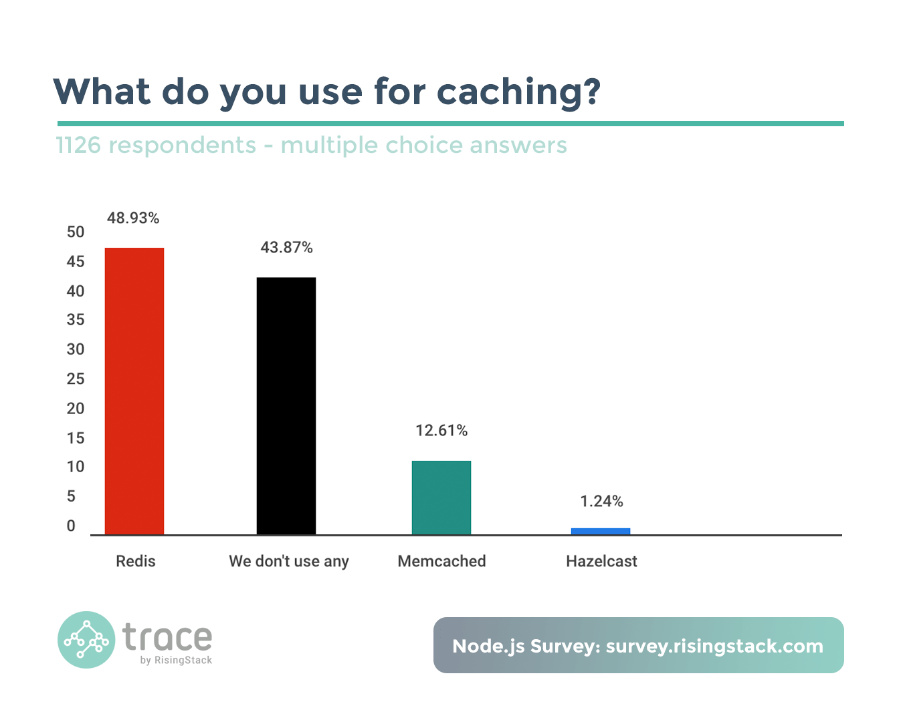
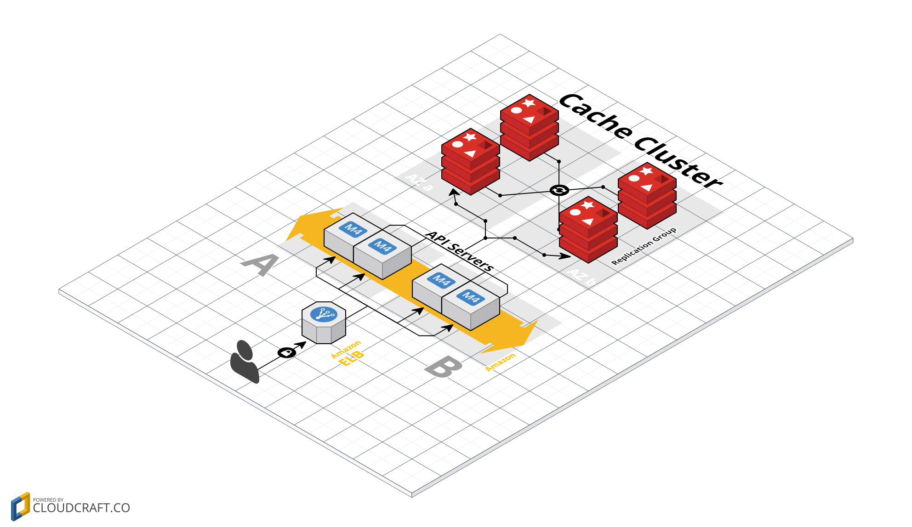

# Utilizando Cache com Redis e Node.js


[](https://travis-ci.org/Kirmayrtomaz/cache_redis_node)
[](https://codecov.io/github/Kirmayrtomaz/cache_redis_node) [](https://david-dm.org/Kirmayrtomaz/cache_redis_node)
[](https://david-dm.org/Kirmayrtomaz/cache_redis_node/dev-status)
[](LICENSE)


# Sumário

* Cache
  * [Introdução](#introducao)
  * Tipos de Cache
    * Cache no cliente(Browser)
    * Cache no Servidor web
    * Cache na Aplicação
  * Vantagens e desvagens de cachear em cada cenário
  * Utilizando cache como um serviço
  * Redis
  * Comparando Redis com memcached
  * Instalando e utilizando Redis e Node.js para cache
    * Cliando um middleware para ser utilizado no express
    * Criando um PUB/SUB para eliminar cache antigos


# Introdução

Atualmente, existem várias APIs em Node.js que trabalham com muito processamento, consulta em banco de dados relacionais e não relacionais, acesso em disco,  serviços legado e inclusive outras APIs. Diversos fatores que geram tempo de requisição, banda, e processamento, nos deixam sujeitos a estruturas que, se mal planejadas, podem gerar um débito técnico no futuro, requerendo mudanças na arquitetura para melhorar a performance da Aplicação. Outras vezes ficamos presos a serviços impostos pelo cliente e seus requisitos, o que nos impede de implementar algo mais estruturado.

Quando você para pra perceber todos os detalhes da sua aplicação, entende que podem existir processos que são realizados várias vezes e retornam dados que não são alterados com tanta frequência. A cada solicitação feita, como a leitura de arquivo, serviços de terceiros ou banco, caímos em uma série de fatores que implicam em tempo, processamento e banda.

Uma situação, por exemplo, seria eu ter que acessar um arquivo e retorná-lo para o usuário. Nesse caso, como já apresentado na literatura, a leitura de um arquivo é lenta, e depende de diversas condições, entre tempo de Seek, o quão espalhado esse arquivo está no seu HD, e outras.

Agora, imagine outra situação. Sua API precisa fazer uma requisição para 5 outros serviços que vão desde a uma request SOAP, consulta ao banco, serviços de terceiros e uma busca no Elasticsearch. Supondo que cada requisição demore 1000ms, precisaríamos de um tempo total de 5000ms para retornar a requisição. No caso do Node.js, poderíamos utilizar algum pacote npm para que as requisições fossem chamadas em paralelo.  Mesmo assim, se eu fizer a mesma requisição várias vezes na minha API e os dados dos outros serviços não forem alteradas com constância, nossa aplicação realizará o mesmo procedimento várias vezes.


Não seria mais fácil nossa aplicação conseguir identificar que essa solicitação já foi feita e retornar os dados salvos em algum lugar, sem a necessidade de realizar tudo novamente?

Exatamente, podemos realizar isso de várias formas, mas o padrão mais conhecido é utilizando cache.


O uso do cache pode ir de a ponta a ponta do nosso sistema, seja na camada do cliente, do servidor web e depois na aplicação.

Na camada do cliente, como um Browser por exemplo, deve-se criar uma forma capaz de coletar esses dados e salvar em alguma API do Browser, como as mais antigas utilizando cookie, ou tecnologias um pouco mais novas como cache com Service Works, tecnologia muito utilizada atualmente com PWA.

Na camada do servidor web, no caso do Ngnix, poderia ser adicionado o ETAG que ajudaria a identificar quando houve uma alteração naquela requisição e Expires/cache-control para tempo de vida que pode ser utilizado aquele conteúdo;

Na camada da aplicação, podemos fazer uma análise mais sucinta dos pontos que são possíveis de serem cacheados e o tempo de vida que cada requisição externa pode ter, garantindo melhor a integridade dos dados que serão repassados para o cliente. Podemos armazenar o cache na memória ou utilizar um serviço para isso.


Pontos Negativos

Na camada do cliente, mesmo criando estruturas que salvem esses dados, seria no mínimo necessário criar uma interface com a aplicação para identificar quando os dados ainda podem ser utilizados. Outro fator também é que possuímos vários tipos de clientes. Falando somente de Browser, temos os mais antigos, que são difíceis de depurar, browsers de dispositivos móveis de versões antigas, além do suporte às APIs que cada um possui.

Na camada de servidor web, podemos ter um outro problema, como um controle generalizado de cache. Num trabalho que participei, tínhamos scripts de coleta de dados em e-commerces do brasil, porém toda vez que atualizamos esse script, que estava salvo nos CDNs da Akamai, o mesmo demorava cerca de um dia para ser propagado em todos os servidores, por conta do cache. Se caso ocorresse um erro, em épocas como a black friday, isso poderia ser uma problema gravíssimo para a coleta dos dados que realizamos. Tudo seria perdido nesse dia.

Na camada da aplicação, utilizar cache em memória também não é um ideia tão favorável, pois uma boa prática é não salvar o estado de nada na api (Stateless). Seria uma complicação precisar escalar horizontalmente e conseguir manter a integridade desse cache.


# Redis
Uma das formas mais robustas de se tratar esses empecilhos é ter uma qualidade melhor no cache, utilizando um servidor ou serviço. O mais comum atualmente é o Redis, que é um banco de dados NoSQL - de chave e valor. Segundo um survey realizado pelo RisingStack com mais de 1000 desenvolvedores, essa ferramenta é adota por quase 50% dos desenvolvedores que trabalham com Node.js, o que mostra a confiança deles nesse ecossistema.



Mas por que escolher o Redis em vez do Memcached, plataforma que já está a muito tempo no mercado ?  Comparando os dois, os mesmos conseguem executar tarefas de cache com alta performance alocando tudo na memória.
Agora se ocorrer um problema no servidor do memcached e for reiniciado o seu cached pois estava salvo numa memória volátil. Com o redis o caso já é diferente, pois este tem um fallback e salva tudo em disco e ao ser reiniciando seu cache voltará normalmente.
Outro ponto é se se o Memcached não estiver aguentando a quantidade de dados alocados na memória , será necessário aumentar o servidor verticalmente. No caso do redis, este tem a capacidade de trabalhar com cluster de até 1000 nós crescendo tanto verticalmente como horizontalmente.
Outro ponto interessante é que o redis também trabalha com PUB/SUB. Por exemplo, imagine que vc tem o serviço A que faz uma chamada para o microserviço B, o serviço A recebe os dados e depois cachea. No caso do serviço B for atualizado, este iria avisar o serviço A que houve uma alteração e que era necessário limpar o cache através de um canal de PUB/SUB. Todos os que estivessem escrito nessa canal seriam capaz de receber essa mensagem e limpar o cache.


De acordo com o site oficial do Redis, ele é um Banco Open-Source que possui seu armazenamento de estrutura de dados em memória e  realiza persistência em disco que pode ser utilizado também como fallback, caso ocorra algum problema no servidor.
Possui também estrutura de chave e valor, e consegue salvar vários tipos de dados, desde uma simples string, como hash, numeros, lista e outros
Possui a função tempo de vida para invalidar dados com um período de tempo
Suporte a transações, oriunda dos bancos de dados relacionais, que respeitam o ACID



O survey mencionado anteriormente mostra que 43% dos desenvolvedores de Node.js não utilizam nenhuma das ferramentas de cache citadas. Isso pode ser um indício de que muitos desenvolvedores não conhecem ferramentas de cache ou acham que a complexidade de inserir isso na sua stack pode comprometer o projeto.

Depois da a explicação, vamos agora criar uma aplicação Node.js que consome um banco de dados e a API do github e cria o cache com o Redis, tudo dockerizado que você poderá acessar nesse link do github.


# Instalando dependencias

Esse projeto, mostra um exemplo em que consultaremos as organizações do github e salvaremos no banco de dados, e retornar a consulta caso já esteja cacheado.

Possuiremos duas rotas
  * **/orgs/{nomeDaOrganizacao}** -> que irá retornar dados da organização
  * **/orgs** -> que irá retornar todas as organizações que já foram consultadas


## Biblioteca do redis para instalar

```   javascript
npm i --save redis
```
or

```
yarn add redis
```

## Inicializando no projeto

```  javascript
const redis = require('redis');
const cache = redis.createClient();

```
## Verificando se a conexão ocorreu com sucesso

```   javascript
cache.on('connect', () => {
  console.log('REDIS READY');
});

cache.on('error', (e) => {
  console.log('REDIS ERROR', e);
});

```


## função para setar o cache

```  javascript
const timeInSecond = 'EX';
const time = 10;
cache.set(keyName, value, timeInSecond, time)
```
* KeyName => será a chave onde será salvo o valor
* value => será o valor que será salvo, no geral pode ser string, inteiro ou objeto de primeira ordem
* timeInSecond => tipo de temporizador que irá utilizar
  * 'EX' => Tempo em segundos
  * 'PX' => Tempo em milisegundos
  * 'NX' => Inserir se não existir
  * 'EX' => Inserir se existir


[123123123](#dependencia)
## função para setar dados de cache

```  javascript
cache.get(keyName);
```

<a href='#dependecias'>teste</a>

## Criando um middleware para o express

```   javascript
const http = require('http');
const express = require('express');
const Promise = require('bluebird');

function cacheMiddleware(req, res, next) {
  return Promise.coroutine(function* () {
    const keyName = req.originalUrl;

    const cacheRes = yield getCache(keyName);

    if (cacheRes) {
      return res.json(cacheRes);
    }
    next();
  })();
}


const app = express(APP_PORT);
httpServer = http.Server(app);
app.use(cacheMiddleware);

app.get('/', (req, res) => {
  res.json({ status: 'The NODE_REDIS XD' });
});

```


## Criando um canal de PUB/SUB


```   javascript
const sub = redis.createClient(REDIS_PORT, REDIS_HOST);
const sub = redis.createClient(REDIS_PORT, REDIS_HOST);

sub.on('message', () => {

});

sub.subscribe('clean_cache');

pub.publish(canal, 'clean');

```


com `express.js` `mongo` `redis` que irá salv

Estas vão rodar em dos cenários, é criando um middleware simples para verificar se já existe cache e retornar os dados

E na outra etapa iremos setar o cache caso necessário, e limpar uma key através de um canal de **PUB/SUB**


Para subir as dependências externas do projeto
* Redis
* MongoDb

basta utilizar esse comando abaixo

```
docker-compose up
```


# Referências

Referência

* [https://redis.io/topics/introduction](https://redis.io/topics/introduction)
*  [http://www.sohamkamani.com/blog/2016/10/14/make-your-node-server-faster-with-redis-cache/](http://www.sohamkamani.com/blog/2016/10/14/make-your-node-server-faster-with-redis-cache/)
* [https://goenning.net/2016/02/10/simple-server-side-cache-for-expressjs/](https://goenning.net/2016/02/10/simple-server-side-cache-for-expressjs/)

* [https://community.risingstack.com/redis-node-js-introduction-to-caching/
](https://community.risingstack.com/redis-node-js-introduction-to-caching/)

* [https://blog.risingstack.com/node-js-developer-survey-results-2016/](https://blog.risingstack.com/node-js-developer-survey-results-2016/)

* [https://www.sitepoint.com/using-redis-node-js/
](https://www.sitepoint.com/using-redis-node-js/)
